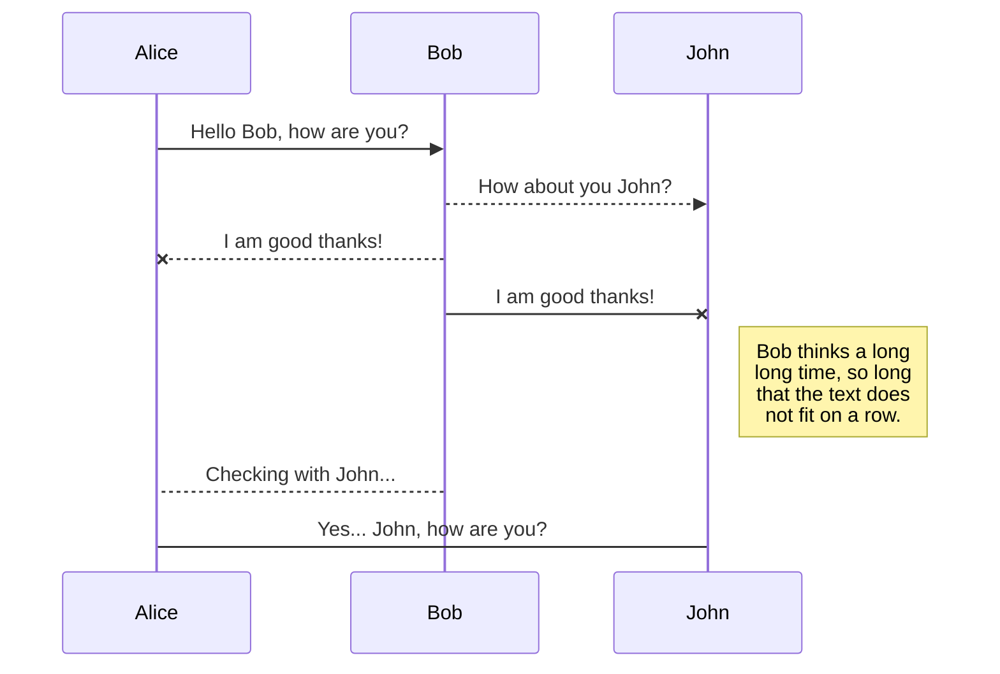
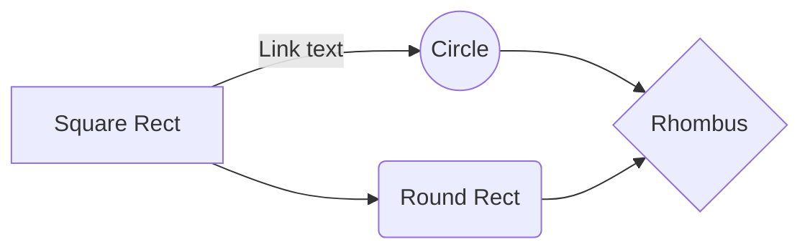

# Welcome to StackEdit!

On September 6-13, grassroots movements from all over the world will meet in Iceland to shape the foundation of a worldwide movement based on democratic confederalism.

September 6-13 several grassroots movements from across the world will gather in Iceland to build a movement for worldwide democratic confederalism to discuss ecological strategies. 

100 hundreds years ago Europe went through a tumultuous time,  which leads to the rise of dictatorships and a further world war. 
At the speed of light of current technological advances , the information society is developing into a smart version of the world where *Products of capitalism indoctrinate and manipulate, promote false consciousness, society falls under hypnosis of capitalist mass culture*

Democratic left-wing movements have progressively lost strength and look unaware of people's basic right  and parliamentary democracy is moving towards authoritarianism and fascism, and the spread of the global extreme right.
Governments and politicians seem tied to the interests  big companies, exposing how those governments and  institutions are incapable of taking the necessary measures on climate and social issues.

While the  climate crisis is urging us to take care of the planet, we are witnessing the social collapse of democratic socialism,  unable to solve environment  urgency as well as  giving practical answers to marginalization and inequality. 
 
The climate emergency has generated a new wave of worldwide movements, from Friday for the future to Extintion Rebellion, showing that more than ever people are willing to take action and defend a future environmentally sustainable, calling on governments for the implementation of climate policies. 

It is now,  more than ever, we have to figure out a way to empower the peoples and communities around the world should join to  take control of their future, and build the alternative societies the earth needs. 

Now more than ever, laying the foundation of a global  democratic confederalism is needed. 

It is through Democratic confederalism peoples can reclaim direct democratic power and implement ecological, social and political solutions for our common good, and an international movement is called to form the basis  lead the process.

An important number of local and global groups have already signed up to come together to hold a preliminary meeting in Iceland, where emphasis will be placed on the creation of a broad and inclusive network of movements, called to  establish the 2020 agenda.

We will work together,  educating ourselves and  plan how our movements will practically empower people to get organized and organize  to respond to the ecological emergency. 
Once we meet in Iceland, We will return to our countries with the willingness and preparation necessary to begin to
to organize for a new future and to build the movement from the base.
to  build a global movement  promotion and democratic confederalism. 

# Files

## Create files and folders

You can also create folders by clicking the **New folder** button.

## Switch to another file

## Rename a file

## Delete a file

## Export a file

# Synchronization

	> To start syncing your workspace, just sign in with Google in the menu.

- The file synchronization will keep one file of the workspace synced with one or multiple files in **Google Drive**, **Dropbox** or **GitHub**.
	> Before starting to sync files, you must link an account in the **Synchronize** sub-menu.

## Open a file

You can open a file from **Google Drive**, **Dropbox** or **GitHub** by opening the **Synchronize** sub-menu and clicking **Open from**. Once opened in the workspace, any modification in the file will be automatically synced.

## Save a file

You can save any file of the workspace to **Google Drive**, **Dropbox** or **GitHub** by opening the **Synchronize** sub-menu and clicking **Save on**. Even if a file in the workspace is already synced, you can save it to another location. StackEdit can sync one file with multiple locations and accounts.

## Synchronize a file

Once your file is linked to a synchronized location, StackEdit will periodically synchronize it by downloading/uploading any modification. A merge will be performed if necessary and conflicts will be resolved.

If you just have modified your file and you want to force syncing, click the **Synchronize now** button in the navigation bar.

> **Note:** The **Synchronize now** button is disabled if you have no file to synchronize.

## Manage file synchronization

Since one file can be synced with multiple locations, you can list and manage synchronized locations by clicking **File synchronization** in the **Synchronize** sub-menu. This allows you to list and remove synchronized locations that are linked to your file.

# Publication

Publishing in StackEdit makes it simple for you to publish online your files. Once you're happy with a file, you can publish it to different hosting platforms like **Blogger**, **Dropbox**, **Gist**, **GitHub**, **Google Drive**, **WordPress** and **Zendesk**. With [Handlebars templates](http://handlebarsjs.com/), you have full control over what you export.

> Before starting to publish, you must link an account in the **Publish** sub-menu.

## Publish a File

You can publish your file by opening the **Publish** sub-menu and by clicking **Publish to**. For some locations, you can choose between the following formats:

- Markdown: publish the Markdown text on a website that can interpret it (**GitHub** for instance),
- HTML: publish the file converted to HTML via a Handlebars template (on a blog for example).

## Update a publication

After publishing, StackEdit keeps your file linked to that publication which makes it easy for you to re-publish it. Once you have modified your file and you want to update your publication, click on the **Publish now** button in the navigation bar.

> **Note:** The **Publish now** button is disabled if your file has not been published yet.

## Manage file publication

Since one file can be published to multiple locations, you can list and manage publish locations by clicking **File publication** in the **Publish** sub-menu. This allows you to list and remove publication locations that are linked to your file.

# Markdown extensions

StackEdit extends the standard Markdown syntax by adding extra **Markdown extensions**, providing you with some nice features.

> **ProTip:** You can disable any **Markdown extension** in the **File properties** dialog.

## SmartyPants

SmartyPants converts ASCII punctuation characters into "smart" typographic punctuation HTML entities. For example:

|                |ASCII                          |HTML                         |
|----------------|-------------------------------|-----------------------------|
|Single backticks|`'Isn't this fun?'`            |'Isn't this fun?'            |
|Quotes          |`"Isn't this fun?"`            |"Isn't this fun?"            |
|Dashes          |`-- is en-dash, --- is em-dash`|-- is en-dash, --- is em-dash|

## KaTeX

You can render LaTeX mathematical expressions using [KaTeX](https://khan.github.io/KaTeX/):

The *Gamma function* satisfying $\Gamma(n) = (n-1)!\quad\forall n\in\mathbb N$ is via the Euler integral

$$
\Gamma(z) = \int_0^\infty t^{z-1}e^{-t}dt\,.
$$

> You can find more information about **LaTeX** mathematical expressions [here](http://meta.math.stackexchange.com/questions/5020/mathjax-basic-tutorial-and-quick-reference).

## UML diagrams

You can render UML diagrams using [Mermaid](https://mermaidjs.github.io/). For example, this will produce a sequence diagram:

And this will produce a flow chart:

<!--stackedit_data:
eyJoaXN0b3J5IjpbLTkxMzA0MzkxM119
-->